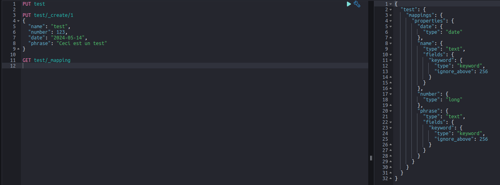
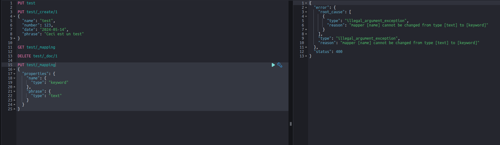

# Mapping dynamique

# Mapping explicite

- Il serait possible de faire du champ `name` un simple `keyword`
- Il serait possible de faire du champ `phrase` un simple `text`

Il n'est pas possible de modifier directement le mapping d'un index.
Le seul moyen de le faire sans supprimer l'index serait d'ajouter un champ avec le type souhaité.

